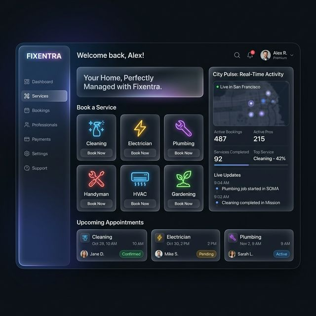

# 🚀 Fixentra: The Future of Home Services in Patna

[](https://opensource.org/licenses/MIT)
[](https://nodejs.org/)
[](https://www.mongodb.com/)
[](https://expressjs.com/)

> **"Your Home, Our Expertise."**  
> A premium, high-end home services platform tailored for the unique cultural and logistical landscape of Patna. From glassmorphic dashboards to real-time AI-assisted concierge, Fixentra redefines how you manage your living space.

---

## 🖼️ Visual Experience



*A glimpse into the cinematic dark mode and glassmorphic UI of the Fixentra Dashboard.*

---

## ✨ Premium Features

### 💎 Elite UI/UX
- **Cinematic Dark Mode**: A deep, immersive dark theme with vibrant neon accents.
- **Glassmorphic Design**: Modern, translucent UI components that feel light and premium.
- **Interactive Tikuli Cursor**: A custom-themed cursor celebrating the heritage of Tikuli art from Patna.
- **Madhubani Accents**: Subtle design motifs inspired by the rich cultural history of Bihar.

### 🛠️ Cutting-Edge Backend
- **Real-Time AI Concierge (Vishwa)**: An AI-driven virtual assistant to help users find the right service experts.
- **Geospatial Expert Matching**: Smart matching of service experts based on real-time location and service urgency.
- **Real-Time WebSockets Chat**: Instant communication between customers and service experts.
- **Automated PDF Invoicing**: High-end, professional billing generated automatically for every completed job.

### 💰 Rewards & Growth
- **Referral & Wallet System**: Earn rewards for bringing friends. Manage your credits in a sleek digital wallet.
- **Expert Gamification**: Tiered expert levels based on performance, reviews, and completion rates.

### 📱 Modern Reliability
- **PWA (Progressive Web App)**: Install Fixentra directly to your home screen for an app-like experience.
- **Offline Capabilities**: Access your critical booking information even when the internet is spotty.
- **City Pulse Dashboard**: A real-time overview of home service trends and demand across Patna.

---

## 🛠️ Technology Stack

- **Backend**: Node.js, Express.js
- **Database**: MongoDB with Mongoose ODM
- **Real-Time**: Socket.io (WebSockets)
- **Authentication**: JWT (JSON Web Tokens) with Bcrypt password hashing
- **UI/UX**: Vanilla CSS (Premium Glassmorphism), Tikuli-themed SVG animations
- **Tools**: PDFKit (Invoice Gen), Sharp (Image Optimization), Morgan (Logging)

---

## 📂 Project Architecture

``` text
FIXENTRA/
├── config/             # DB Connectivity & App Config
├── controllers/        # Business Logic & Request Handling
├── middleware/         # Auth, Role Guards & Error Handlers
├── models/             # Mongoose Schemas (User, Booking, Service, etc.)
├── public/             # Frontend Assets (PWA, Styles, Scripts)
├── routes/             # API Endpoints
├── utils/              # Helper Utilities (Email, PDF Gen)
├── docs/               # Documentation & README Assets
└── server.js           # Entry Point & Socket Setup
```

---

## 🚀 Getting Started

### 1. Prerequisites
- **Node.js** (v16.x or higher)
- **MongoDB** (Local or Atlas)
- **NPM** or **Yarn**

### 2. Installation
```bash
# Clone the repository
git clone https://github.com/Abhi-2636/FIXENTRA.git

# Enter the directory
cd FIXENTRA

# Install dependencies
npm install
```

### 3. Environment Setup
Create a `.env` file in the root directory:
```env
PORT=5000
NODE_ENV=development
MONGO_URI=your_mongodb_connection_string
JWT_SECRET=your_hyper_secret_key
JWT_EXPIRES_IN=30d
ADMIN_EMAIL=admin@fixentra.com
```

### 4. Running the Application
```bash
# Start the development server (with nodemon)
npm run dev

# For production
npm start
```

---

## 📬 API Integration

| Method | Endpoint | Description | Access |
| :--- | :--- | :--- | :--- |
| `POST` | `/api/auth/register` | User/Expert Registration | Public |
| `POST` | `/api/auth/login` | Secure JWT Login | Public |
| `GET` | `/api/services` | List Service Categories | Public |
| `POST` | `/api/bookings` | Create New Booking | User |
| `GET` | `/api/bookings/expert` | Get Assigned Jobs | Expert |
| `PATCH` | `/api/admin/bookings` | Manage All Bookings | Admin |

---

## 🤝 Contributing

Fixentra is an evolving ecosystem. We welcome contributions that push the boundaries of what home services can look like in modern India.

1. Fork the Project
2. Create your Feature Branch (`git checkout -b feature/AmazingFeature`)
3. Commit your Changes (`git commit -m 'Add some AmazingFeature'`)
4. Push to the Branch (`git push origin feature/AmazingFeature`)
5. Open a Pull Request

---

## 📄 License

Distributed under the MIT License. See `LICENSE` for more information.

---

<p align="center">
  Built with ❤️ for <strong>Patna</strong>
</p>
